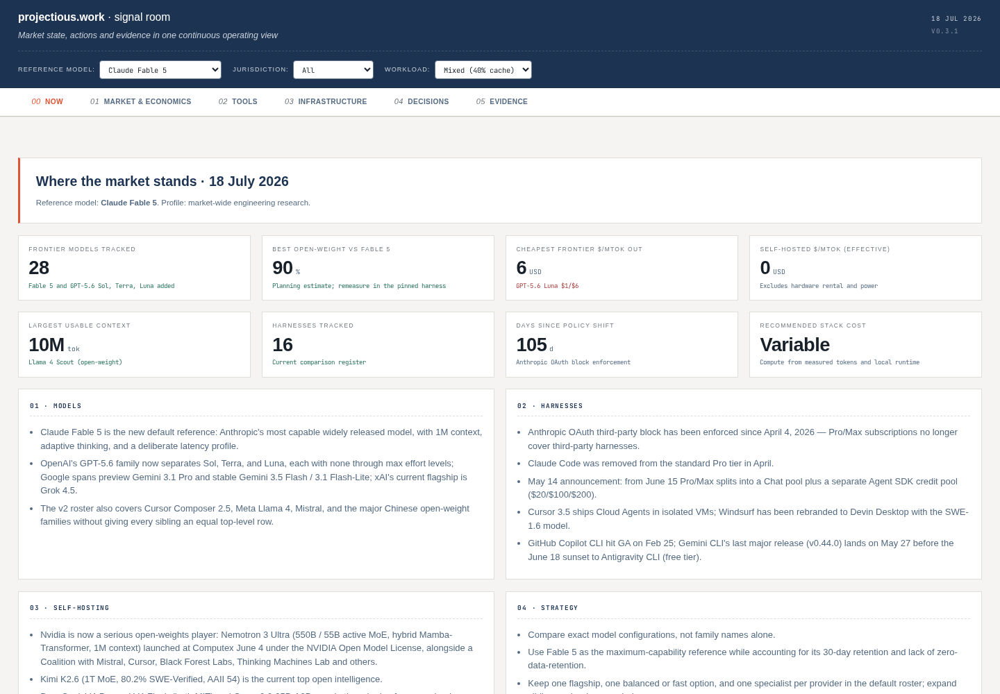

# ai-market-research

[](https://github.com/projectious-work/ai-market-research/releases/latest)
[](https://projectious-work.github.io/ai-market-research/)
[](LICENSE)
[](#project-status)

A static intelligence report tracking the AI model and tooling landscape,
focused on the decisions an AI infrastructure-oriented developer actually
has to make: which models and configurations to use, which subscriptions to
hold, which agent harness to run, and what to self-host.

**Live Signal Room:** <https://projectious-work.github.io/ai-market-research/>
**Latest release:** <https://github.com/projectious-work/ai-market-research/releases/latest>
([v0.3.3](https://github.com/projectious-work/ai-market-research/releases/tag/v0.3.3))

[](https://projectious-work.github.io/ai-market-research/)

---

## What it tracks

1. **Current model roster** — a concise view of Anthropic, OpenAI, Google,
   xAI, Meta, Mistral, Cursor, and major Chinese labs. The roster includes Kimi
   K3 and the still-available GPT-5.5 family while keeping sibling variants
   curated rather than exhaustive.
2. **Model configurations** — provider-native reasoning controls such as
   effort, thinking levels, token budgets, modes, and speed variants. Claude
   Fable 5 is the default reference for the v2 report.
3. **Speed evidence** — time to first token, output throughput, and end-to-end
   task latency are treated as separate dimensions. Vendor claims and unknown
   values are labelled instead of being presented as comparable measurements.
4. **Quota burn cross-matrix** — the existing model by reasoning-effort cost
   analysis remains available while the v2 configuration schema is evaluated.
5. **Agent harnesses** — Claude Code, OpenCode, Codex CLI, Gemini CLI,
   Aider, Cline, Roo Code, Cursor, Windsurf, Goose, OMO, OpenClaw, CCR,
   Hermes.
6. **Self-hosting** — dated GPU-hosting prices and configurations from Runpod,
   Hyperstack, Contabo, Infomaniak, and Vast.ai; local Mac configurations;
   open-weight model fit; quantization formats; and inference frameworks.
7. **Strategy** — derived recommendations spanning the above.

## How it's built

- `data/market-state.json` — original report data and compatibility schema.
- `data/model-roster-v2.json` — sourced current roster, inclusion policy,
  configuration controls, and speed methodology.
- `data/report-metrics.json` — benchmark evidence, reference-relative quality,
  trend series, current economics, hardware fit, and decision-support data.
- `src/dashboard.template.html` — single self-contained HTML scaffold
  with a `__MARKET_DATA__` placeholder.
- `src/scripts/build.py` — validates and embeds all three JSON inputs,
  producing `dist/dashboard.html`.
- [`docs/data-methodology.md`](docs/data-methodology.md) — formulas, evidence
  classes, chart encodings, and the repeatable update procedure.

The outputs are self-contained static HTML files. There is no JavaScript
framework, package-manager build chain, or runtime CDN dependency.

The research-data rules covering source rights, attribution, permitted use,
retention, update verification, and privacy review are documented in
[`docs/research-data-policy.md`](docs/research-data-policy.md).

## Quickstart

Requires `python3`, `bash`, `git`, and (for deploys) the `gh` CLI.

```sh
# Build the dashboard
bash src/scripts/build.sh

# Validate JSON + rebuild + sanity-check the artifact
bash src/scripts/release-check.sh

# Open the current report
xdg-open dist/dashboard.html

```

## Deploy

GitHub Pages is fed from the root of the `gh-pages` branch by a local script.
No GitHub Actions workflow is used or permitted. Architecture:
[DEC-20260517_1455-DeftLynx](context/decisions/DEC-20260517_1455-DeftLynx-v0-2-0-deployment-local-deploy.md).

```sh
bash src/scripts/release-check.sh
bash src/scripts/deploy.sh --message "deploy: refresh signal room"
```

The deploy script rebuilds by default, stages the report and screenshot in a
temporary Git worktree, pushes `gh-pages` without force, and verifies that
Pages uses the legacy branch source with HTTPS. It stops if any file exists
under `.github/workflows/`. Use `--skip-build` only after reviewing the exact
local artifact that will be published.

## Release

Releases follow the repository's phased release process. Start with the
process definition referenced in `AGENTS.md`; the release orchestrator can
then run individual phases or a validated full sequence:

```sh
bash src/scripts/release.sh --list
bash src/scripts/release.sh --phase 0
```

Do not cut a version directly before the release gates have been evaluated.

## Repository layout

```
.
├── data/              # source JSON, normalized metrics, and archives
├── src/
│   ├── dashboard.template.html
│   ├── dashboard-context.md   # project profile + tracked dimensions
│   ├── sources.md             # canonical URLs the briefing checks
│   ├── briefing-prompt.md     # the agent prompt that refreshes data/
│   └── scripts/{build,release-check,deploy,release}.sh
├── dist/              # built dashboard.html (gitignored output)
├── context/           # processkit project context (decisions, logs, …)
├── AGENTS.md          # provider-neutral agent instructions
└── LICENSE
```

## Contributing

This is a public, executive-oriented market report and a reusable static
dashboard implementation. The code is MIT-licensed; fork it freely if the
structure is useful for your own market-watching workflow.

See [CONTRIBUTING.md](CONTRIBUTING.md) for the source, validation, canonical
Git identity, and local deployment requirements. Security reports follow the
private-first process in [SECURITY.md](SECURITY.md).

## Project status

**Lifecycle: active.** The market roster and published dashboard are actively
maintained. Historical snapshots remain available for provenance, but only the
current dashboard and latest tagged release are supported.

## License

Unless otherwise noted, the copyright holder grants the
[**MIT License**](LICENSE) for **all versions of this repository,
including historical commits and tags**. The full license text is in
[LICENSE](LICENSE). © 2026 projectious.

<!-- pk-release-license-note -->
<!-- This block is verified during the release process (phase 6,
     release-docs-current). The license name above must match
     LICENSE's first line; the phrase "historical commits and tags"
     must be present. Keep both intact when editing this section. -->
