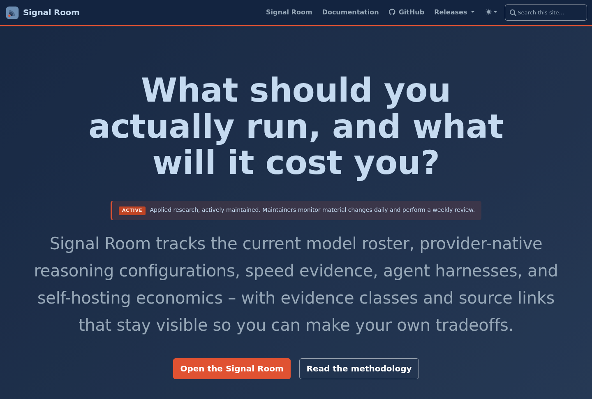

<div align="center">


# Signal Room

**Inspectable decision support for choosing AI models, configurations, agent harnesses, and self-hosting options.**

[](https://github.com/projectious-work/ai-market-research/releases/latest)
[](https://projectious-work.github.io/ai-market-research/)
[](LICENSE)
[](https://projectious-work.github.io/ai-market-research/docs/project-status/)

</div>

---

> [!NOTE]
> **Applied research, actively maintained — and intentionally non-exhaustive.**
> Pricing changes, vendor-reported claims and heterogeneous benchmarks are not
> universally comparable, and its recommendations may not fit every workload.
> Evidence classes, source links, and measurement caveats stay visible so you
> can make your own tradeoffs.
>
> Full detail: [Project Status](https://projectious-work.github.io/ai-market-research/docs/project-status/).

---

**Site:** <https://projectious-work.github.io/ai-market-research/>
**Dashboard:** <https://projectious-work.github.io/ai-market-research/dashboard/>
**Latest release:** [](https://github.com/projectious-work/ai-market-research/releases/latest)

[](https://projectious-work.github.io/ai-market-research/dashboard/)

## What this is

Choosing a model, a reasoning configuration, an agent harness, or a
self-hosting setup means comparing vendor claims that are rarely apples to
apples. Signal Room is a non-exhaustive, inspectable report: every number is
either measured, vendor-reported, or explicitly marked unknown, and every
claim keeps a canonical source link.

It tracks the current model roster (Anthropic, OpenAI, Google, xAI, Meta,
Mistral, Cursor, and major Chinese labs) with provider-native reasoning
configurations, separate TTFT/throughput/task-latency speed evidence, a
quota-burn cross-matrix, agent harnesses (Claude Code, Codex CLI, OpenCode,
and others), and dated self-hosting economics (GPU pricing, local Mac fit,
quantization). See
[Data Methodology](https://projectious-work.github.io/ai-market-research/docs/data-methodology/)
for the full breakdown, formulas, and evidence classes.

## How it's built

- `data/*.json` — the roster, model configurations, and normalized report
  metrics that feed the report.
- `src/dashboard.template.html` + `src/scripts/build.py` — validate and embed
  the JSON inputs into a single self-contained `dist/dashboard.html`. No
  JavaScript framework, build chain, or runtime CDN dependency.
- `docs/content/` and `docs/hugo.yaml` — the Hugo website consuming the pinned
  [`brand-theme-hugo-vanilla` v0.3.3](https://github.com/projectious-work/brand-theme-hugo-vanilla/releases/tag/v0.3.3)
  module. The website provides a landing page, mock Dashboard, Documentation,
  and Change Log without embedding the legacy report UI.

Research-data rules (source rights, attribution, retention, verification,
privacy review) are documented in
[Research Data Policy](https://projectious-work.github.io/ai-market-research/docs/research-data-policy/).

## Quick start

Requires `python3`, `bash`, `git`, and (for deploys) the `gh` CLI. Building
the website additionally requires Hugo Extended, Go, and Node.js/npm.

```sh
bash src/scripts/build.sh           # build the report: dist/dashboard.html
bash src/scripts/release-check.sh   # validate + rebuild + sanity-check
bash docs/scripts/serve-docs.sh     # serve the branded site on port 1320
```

Full walkthrough:
[Quick Start](https://projectious-work.github.io/ai-market-research/docs/quick-start/).

## Deploy

GitHub Pages is fed from the root of the `gh-pages` branch by a local script.
No GitHub Actions workflow is used or permitted. Architecture:
[DEC-20260727_0742-ClearSpring](context/decisions/DEC-20260727_0742-ClearSpring-migrate-the-published-site-from-raw.md)
(supersedes [DEC-20260517_1455-DeftLynx](context/decisions/DEC-20260517_1455-DeftLynx-v0-2-0-deployment-local-deploy.md)).

```sh
bash src/scripts/release-check.sh
bash docs/scripts/deploy-docs.sh --message "deploy: refresh signal room"
```

The deploy script rebuilds the Hugo site by default, stages
the payload in a temporary Git worktree, pushes `gh-pages` without force, and
verifies that Pages uses the legacy branch source with HTTPS.

## Release

Releases follow the repository's phased release process, defined in
`AGENTS.md`:

```sh
bash src/scripts/release.sh --list
bash src/scripts/release.sh --phase 0
```

Do not cut a version directly before the release gates have been evaluated.

## Repository layout

```
data/                          Source JSON, normalized metrics, archives
src/                           Report template, build script, briefing prompt
dist/                          Built dashboard.html (gitignored)
docs/content/ docs/hugo.yaml   Hugo site content and configuration
docs/static/logo/              Signal Room mark (light/dark/mono variants)
scripts/{build,serve,deploy}-docs.sh   Hugo site build / serve / publish
docs/go.mod                    Pinned projectious.work brand theme module
context/                       processkit project context (decisions, logs, …)
AGENTS.md                      Provider-neutral agent instructions
```

## Contributing

This is a public, executive-oriented market report and a reusable static
dashboard implementation. The code is MIT-licensed; fork it freely if the
structure is useful for your own market-watching workflow.

See [CONTRIBUTING.md](CONTRIBUTING.md) for validation, canonical Git
identity, and deployment requirements. Security reports follow
[SECURITY.md](SECURITY.md).

## Project status

**Lifecycle: active.** The market roster and published report are actively
maintained. Historical snapshots remain available for provenance, but only
the current report and latest tagged release are supported.

## License

Unless otherwise noted, the copyright holder grants the
[**MIT License**](LICENSE) for **all versions of this repository,
including historical commits and tags**. The full license text is in
[LICENSE](LICENSE). © 2026 projectious.

Brand and design system © [projectious.work](https://github.com/projectious-work/brand).
The Signal Room mark is derived from that system.

<!-- pk-release-license-note -->
<!-- This block is verified during the release process (phase 6,
     release-docs-current). The license name above must match
     LICENSE's first line; the phrase "historical commits and tags"
     must be present. Keep both intact when editing this section. -->
